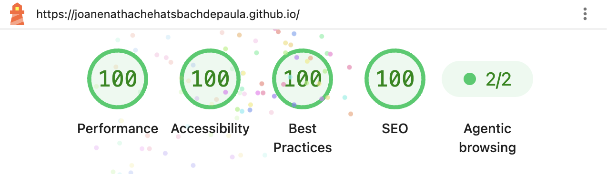

# Joane Hatsbach - Landing Page

> "Good dermatology lives in the details." — Joane Nathache Hatsbach de Paula

  

**Hello, Dev!**

This repository holds the project for the landing page of Joane Nathache Hatsbach de Paula, a dermatologist based in Curitiba - PR, Brazil. The application was built with HTML, CSS and JavaScript, and was developed to present her practice and make booking an appointment easier.

## Quick Access

> 🌐 The application is hosted on GitHub Pages: [https://joanenathachehatsbachdepaula.github.io/](https://joanenathachehatsbachdepaula.github.io/)

## Performance & Accessibility

The page is a static build with no framework and no build step, tuned against a Lighthouse audit (mobile profile, simulated throttling):

## Contact

Questions or feedback are welcome:

- [LinkedIn](https://www.linkedin.com/in/noahbarrosurban/)
- [GitHub](https://github.com/noahbarrosurban)
- [noahbarrosurban@gmail.com](mailto:noahbarrosurban@gmail.com)
